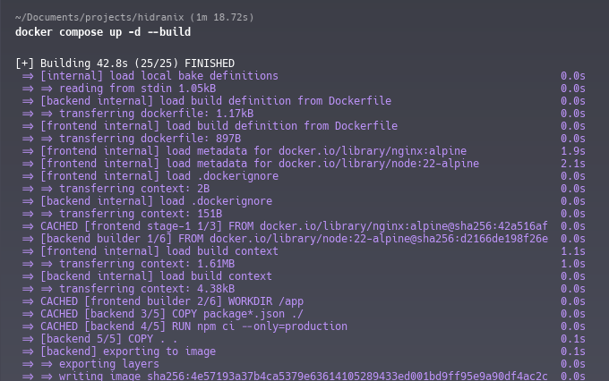
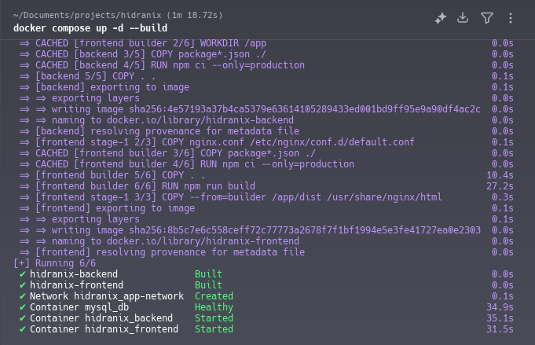
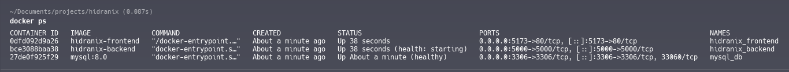
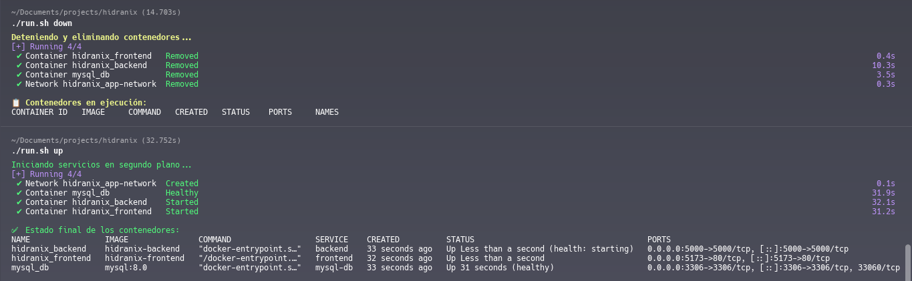

# Configuración de Entorno Docker para Aplicación Full-Stack

El presente informe detalla la configuración e implementación de un entorno Docker para una aplicación full-stack compuesta por un frontend en React con ViteJS, un backend en Node.js y una base de datos MySQL. El objetivo fue crear una infraestructura containerizada que permita el desarrollo, despliegue y escalamiento consistente de la aplicación.

## Arquitectura de la Solución

### Componentes Implementados

**Frontend (hidranix-client)**
- Framework: React con ViteJS
- Puerto de exposición: 5173
- Variables de entorno: Configuración de API y claves de servicios externos

**Backend (hidranix-server)**
- Tecnología: Node.js
- Puerto de exposición: 5000
- Variables de entorno: Conexión a base de datos, JWT, claves de APIs externas

**Base de Datos**
- Motor: MySQL 8.0
- Puerto: 3306
- Credenciales: Usuario personalizado con permisos específicos

### Estructura de Archivos

```
hidranix/
├── docker-compose.yml
├── run.sh
├── hidranix-server/
│   ├── Dockerfile
│   ├── .env
│   ├── package.json
│   └── server.js
├── hidranix-client/
│   ├── Dockerfile
│   ├── .env
│   ├── package.json
│   └── vite.config.js
└── mysql-init/
    └── init.sql
```

## Configuración Docker

### Docker Compose

Se implementó un archivo `docker-compose.yml` que define tres servicios interconectados mediante una red bridge personalizada (`app-network`). La configuración incluye:

- Gestión de volúmenes para persistencia de datos
- Health checks para verificación de estado de servicios
- Configuración de reinicio automático
- Mapeo de puertos adecuado

### Variables de Entorno

Se configuraron dos archivos `.env` independientes:

**Backend (.env)**
```env
DB_HOST=mysql-db
DB_PORT=3306
DB_USER=appuser
DB_PASSWORD=apppassword
DB_DATABASE=hidranix
CLERK_WEBHOOK_SIGNING_SECRET=whsec_90V7******
JWT_SECRET_KEY=hidranix-cocinando-con-hidrogeno
JWT_TOKEN_EXPIRES_IN=1h
SALT_ROUNDS=10
MP_PUBLIC_KEY=TEST-b87329fb******
MP_ACCESS_TOKEN=TEST-1418989473464773-032312****
FRONTEND_URL=http://localhost:5173
NODE_ENV=development
PORT=5000
```

**Frontend (.env)**
```env
VITE_BACKEND_URL=http://localhost:5000
VITE_CLERK_PUBLISHABLE_KEY=pk_test_d29yd******
VITE_MP_PUBLIC_KEY=TEST-b87329fb-3******
```

### Optimizaciones Implementadas

**Multi-stage Builds**
Se implementó construcción en etapas múltiples para el frontend, reduciendo el tamaño final de la imagen de producción.

**Cache de Dependencias**
Estrategia de copia de archivos package.json primero para aprovechar el cache de Docker y acelerar builds posteriores.

**Seguridad**
- Usuarios no-root en contenedores
- Credenciales específicas por servicio
- Variables de entorno para datos sensibles

**Resiliencia**
- Health checks automáticos
- Políticas de reinicio
- Dependencias ordenadas entre servicios

## Script de Automatización

Se desarrolló un script `run.sh` completo para gestionar el ciclo de vida de los contenedores:

### Funcionalidades Principales

- Inicio y detención de servicios
- Visualización de logs
- Ejecución de comandos dentro de contenedores
- Limpieza de recursos
- Monitorización de estado

### Comandos Disponibles

```bash
./run.sh up           # Iniciar servicios en segundo plano
./run.sh up-dev       # Modo desarrollo en primer plano
./run.sh down         # Detener y eliminar contenedores
./run.sh logs         # Visualizar logs
./run.sh exec-backend # Ejecutar comandos en backend
./run.sh clean        # Limpieza completa
./run.sh help         # Documentación
```

## Solución de Problemas

### Issue: Variables de Entorno no Encontradas

Se identificó y resolvió un problema donde Docker Compose intentaba expandir variables de entorno desde el shell del host antes de cargar los archivos `.env` específicos de cada servicio.

**Solución Implementada**
- Remoción de la sección `environment` redundante en docker-compose.yml
- Uso exclusivo de `env_file` para carga de variables
- Configuración limpia sin advertencias de variables no definidas

### Flujo de Trabajo Corregido

1. Docker Compose carga el archivo compose
2. Lee los archivos `.env` especificados en `env_file`
3. Las variables están disponibles para los contenedores
4. No hay expansión prematura de variables

## Comandos de Verificación

Para validar el correcto funcionamiento:

```bash
# Verificar estado de contenedores
docker-compose ps

# Verificar logs de inicialización
docker-compose logs backend

# Verificar conectividad de red
docker-compose exec backend ping mysql-db

# Verificar variables de entorno en contenedor
docker-compose exec backend env
```

## Próximos Pasos

### Mejoras Futuras

1. **Configuración de Entornos Múltiples**
   - Diferentes archivos compose para desarrollo, testing y producción
   - Variables de entorno específicas por ambiente

2. **Monitoreo y Logging**
   - Implementación de ELK stack o similar
   - Métricas de performance de contenedores

3. **Seguridad Avanzada**
   - Secrets management con Docker Secrets o Vault
   - Escaneo de vulnerabilidades en imágenes

4. **CI/CD Integration**
   - Automatización de builds y despliegues
   - Tests automatizados en pipeline

### Consideraciones de Producción

- Configuración de recursos límite (CPU, memoria)
- Estrategias de despliegue blue-green
- Backup y recovery procedures
- Monitorización de salud de servicios

## Conclusiones

La implementación realizada proporciona una base sólida para el desarrollo y despliegue de aplicaciones full-stack containerizadas. La arquitectura permite escalamiento horizontal, facilita el onboarding de nuevos desarrolladores y asegura consistencia entre entornos de desarrollo y producción.

La solución aborda aspectos críticos como seguridad, manejo de configuraciones y automatización, estableciendo las bases para un flujo de trabajo DevOps robusto.

---

**Anexo: Capturas de Pantalla**

1. ***Ejecución exitosa de docker-compose up***





2. ***Comprobar servicios activos***



3. ***Script run.sh en funcionamiento para encender y eliminar los contenedores***

