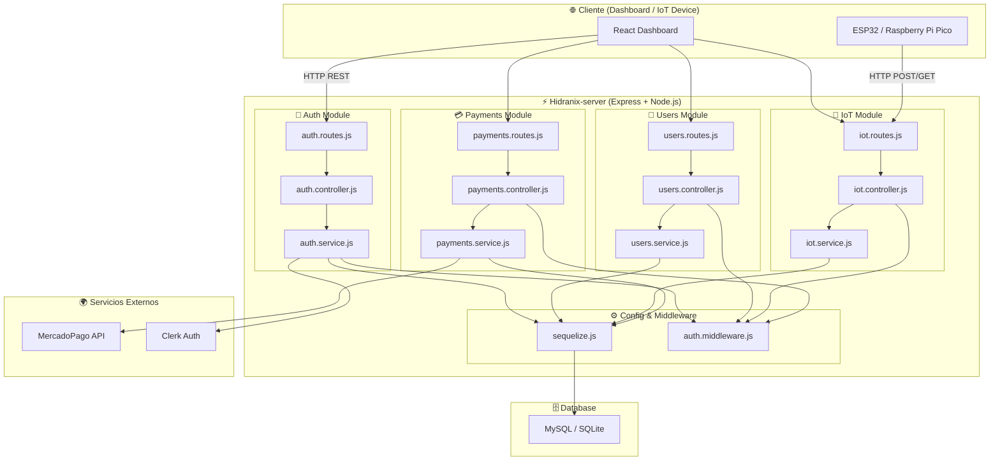

# **Hidranix Server**

**Hidranix-server** es el backend encargado de:

* Manejar las **peticiones del Dashboard** (visualización de datos, estadísticas, clientes, pagos).
* Gestionar la **autenticación y registro de usuarios** mediante Clerk y JWT.
* Procesar las **peticiones HTTP de dispositivos IoT** (ESP32, Raspberry Pi Pico, etc.).
* Encargarse de la **persistencia de datos** utilizando el ORM **Sequelize** con soporte para MySQL y SQLite.
* Integrarse con **MercadoPago** para pagos en línea.

---

## 📂 Estructura del proyecto

```bash
├── Dockerfile
├── index.js
├── package.json
├── package-lock.json
├── src
│   ├── app.js
│   ├── auth
│   │   ├── auth.controller.js
│   │   ├── auth.routes.js
│   │   ├── auth.service.js
│   │   └── auth.validation.js
│   ├── config
│   │   ├── config.js
│   │   ├── database.js
│   │   └── sequelize.js
│   ├── iot
│   │   ├── iot.controller.js
│   │   ├── iot.model.js
│   │   ├── iot.routes.js
│   │   └── iot.service.js
│   ├── middlewares
│   │   └── auth.middleware.js
│   ├── payments
│   │   ├── mercadopago.service.js
│   │   ├── payments.controller.js
│   │   ├── payments.model.js
│   │   ├── payments.routes.js
│   │   └── payments.service.js
│   └── users
│       ├── users.controller.js
│       ├── users.model.js
│       ├── users.routes.js
│       └── users.service.js
└── test
    └── temperature.sh
```



👉 Este diagrama muestra:

* Los **clientes** (Dashboard web y dispositivos IoT).
* Los **módulos del servidor**: Auth, Users, IoT, Payments, con sus capas (routes, controller, service).
* El uso de **middlewares y Sequelize** para conexión a BD.
* La comunicación con **Clerk** para autenticación externa y **MercadoPago** para pagos.
* La persistencia en **MySQL/SQLite**.

---

## ⚙️ Dependencias principales

* **Servidor y utilidades**

  * `express` → framework principal del servidor.
  * `cors`, `cookie-parser`, `body-parser`, `morgan` → middlewares de seguridad y logging.
  * `dotenv` → manejo de variables de entorno.
  * `nodemon` (dev) → recarga automática en desarrollo.

* **Autenticación**

  * `@clerk/express` → integración con Clerk para auth de usuarios.
  * `jsonwebtoken` → generación y verificación de JWT.
  * `bcrypt` → hash seguro de contraseñas.
  * `joi` → validación de datos.

* **Base de datos**

  * `sequelize` → ORM para SQL.
  * `mysql2` y `sqlite3` → adaptadores de base de datos.

* **Pagos**

  * `mercadopago` → integración con la API de pagos.

* **Webhooks**

  * `svix` → manejo de eventos y notificaciones.

---

## 🛠️ Funcionalidades principales

* **Autenticación y usuarios**

  * Registro, login y validación de usuarios.
  * Middleware de autenticación con Clerk + JWT.
  * Validación de datos con `joi`.

* **Módulo IoT**

  * Recepción de datos de sensores IoT (ej: ESP32, Raspberry Pi Pico).
  * Almacenamiento de lecturas en la base de datos.
  * Endpoints de consulta con filtros y agregaciones (ej: promedio de temperaturas).

* **Pagos**

  * Integración con **MercadoPago**.
  * Creación y gestión de órdenes de pago.
  * Persistencia de transacciones.

* **Dashboard**

  * Exposición de endpoints para estadísticas, consumos, historial de pagos y gestión de clientes.

---

## 🌍 Variables de entorno

El backend requiere un archivo `.env` en la raíz del proyecto con las siguientes variables mínimas:

```bash
# Configuración del servidor
PORT=5000

# Base de datos
DB_DIALECT=mysql
DB_HOST=localhost
DB_PORT=3306
DB_USER=root
DB_PASSWORD=123456
DB_NAME=hidranix_db

# Clerk
CLERK_SECRET_KEY=sk_test_***

# JWT
JWT_SECRET=tu_clave_secreta

# MercadoPago
MERCADOPAGO_ACCESS_TOKEN=TEST-***

```

---

## ▶️ Scripts

* **Desarrollo**

```bash
npm run dev
```

Inicia el servidor con **Nodemon** en modo desarrollo.

---

## 📡 Endpoints principales

### Autenticación

* `POST /auth/register` → registrar usuario.
* `POST /auth/login` → iniciar sesión.

### Usuarios

* `GET /users/` → listar usuarios.

### IoT

* `POST /iot/temperature` → registrar temperatura.
* `GET /iot/temperature/:userId` → obtener datos crudos.
* `GET /iot/temperature/weekly/:userId` → obtener promedio diario de la última semana.

### Pagos

* `POST /payments/create` → crear orden de pago.
* `GET /payments/:userId` → historial de pagos de usuario.

---

## 📂 Código

### `app.js`

```javascript
import express from "express";
import cors from "cors";
import path from "path";
import morgan from "morgan";
import cookieParser from "cookie-parser";
import usersRoutes from "./users/users.routes.js";
import paymentsRoutes from "./payments/payments.routes.js";
import authRoutes from './auth/auth.routes.js';
import iotRoutes from "./iot/iot.routes.js";
import { FRONTEND_URL } from './config/config.js';

const app = express();

const allowedOrigins = [
  FRONTEND_URL // dominio permitido
];

// Configuración dinámica de CORS
app.use(cors({
  origin: (origin, callback) => {
    if (!origin) {
      // Permitir solicitudes sin origin (ej. Postman, curl)
      return callback(null, true);
    }
    if (allowedOrigins.includes(origin)) {
      // Si el dominio está permitido
      return callback(null, true);
    }
    // En este caso, se permite cualquier origen (flexible)
    return callback(null, true);
  },
  credentials: true, // habilita cookies / headers de autenticación
  methods: ["GET", "POST", "PUT", "PATCH", "DELETE", "HEAD"],
  allowedHeaders: ["Content-Type", "Authorization"],
  optionsSuccessStatus: 204
}));

// Middleware de rutas
app.use('/auth', authRoutes);

// Middleware general
app.use(express.json());            // Manejo de JSON
app.use(cookieParser());            // Manejo de cookies
app.use(morgan('dev'));             // Logs en consola
app.use(express.static(path.resolve("public"))); // Archivos estáticos

// Rutas principales
app.use("/users", usersRoutes);       // Módulo de usuarios
app.use("/payments", paymentsRoutes); // Módulo de pagos
app.use("/iot", iotRoutes);           // Módulo IoT

export default app;
```

---

* **Express App**: Se crea la aplicación principal con `express()`.
* **CORS dinámico**: Se define qué orígenes pueden consumir la API, validando contra `FRONTEND_URL`. Si no hay restricción, se permite todo (útil para Postman o curl).
* **Middlewares globales**:

  * `express.json()` → procesa JSON en requests.
  * `cookieParser()` → permite leer cookies.
  * `morgan('dev')` → genera logs de peticiones HTTP.
  * `express.static("public")` → sirve archivos estáticos (ej. imágenes).
* **Rutas**: Se organiza en módulos independientes:

  * `/auth` → autenticación de usuarios.
  * `/users` → gestión de usuarios.
  * `/payments` → pagos e integración con MercadoPago.
  * `/iot` → recepción de datos de dispositivos IoT (ESP32, Raspberry Pi, etc).


---

## 🐳 Docker

Ejecutar en contenedor:

```bash
docker build -t hidranix-server .
docker run -p 5000:5000 --env-file .env hidranix-server
```

### Dockerfile

```dockerfile
# Usa una imagen base liviana de Node.js (versión 22 en variante slim para menor peso)
FROM node:22-slim

# Establece el directorio de trabajo dentro del contenedor
WORKDIR /app

# Copia solo los archivos de dependencias (package.json y package-lock.json)
# Esto permite aprovechar la cache de Docker y evitar reinstalar si el código cambia pero no las dependencias
COPY package*.json ./

# Instala solo las dependencias de producción, omitiendo devDependencies
RUN npm install --omit=dev

# Copia el resto del código del proyecto dentro del contenedor
COPY . .

# Expone el puerto 5000 para que pueda ser accedido desde fuera del contenedor
EXPOSE 5000

# Define la variable de entorno para que Node se ejecute en modo producción
ENV NODE_ENV=production

# Comando por defecto para ejecutar la aplicación
CMD ["node", "index.js"]
```